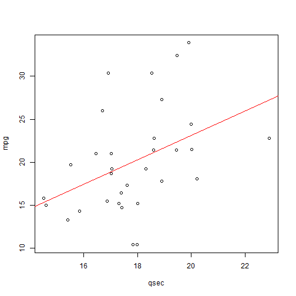

MTCARS shiny App
========================================================
author: Gabriele
date: 26/12/2015 

App Description
========================================================

This App shows the relationships between the Miles Per Gallon (MPG) and
the other variables, as in the MTCARS data set.
- Number of cylinders = "cyl"
- Displacement (cu.in.) = "disp",
- Gross horsepower = "hp",
- Rear axle ratio = "drat",
- Weight (lb/1000) = "wt",
- 1/4 mile time = "qsec",
- V/S = "vs",
- Transmission type = "am",
- Number of forward gears = "gear",
- Number of carburetors = "carb"


Data Source
========================================================
The data was extracted from the 1974 Motor Trend US magazine,                                     " and comprises fuel consumption and 10 aspects of automobile design and performance for 32 automobiles (1973-74 models).


Analysis example : mpg vs. qsec (1/2)
========================================================


```r
library(datasets)
m <-lm(mpg~qsec, data = mtcars)
summary(m)
```

```

Call:
lm(formula = mpg ~ qsec, data = mtcars)

Residuals:
    Min      1Q  Median      3Q     Max 
-9.8760 -3.4539 -0.7203  2.2774 11.6491 

Coefficients:
            Estimate Std. Error t value Pr(>|t|)  
(Intercept)  -5.1140    10.0295  -0.510   0.6139  
qsec          1.4121     0.5592   2.525   0.0171 *
---
Signif. codes:  0 '***' 0.001 '**' 0.01 '*' 0.05 '.' 0.1 ' ' 1

Residual standard error: 5.564 on 30 degrees of freedom
Multiple R-squared:  0.1753,	Adjusted R-squared:  0.1478 
F-statistic: 6.377 on 1 and 30 DF,  p-value: 0.01708
```

Analysis example : mpg vs. qsec (2/2)
========================================================


```r
with(mtcars, {plot(mpg~qsec); abline(m,col=2)})
```

 
